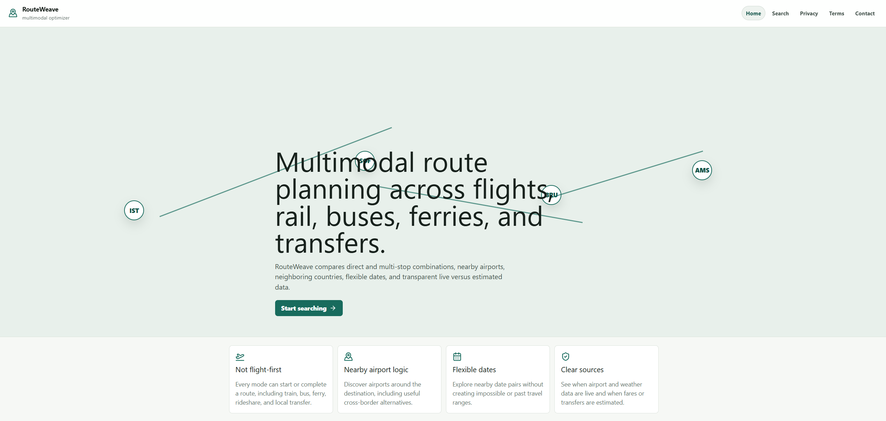
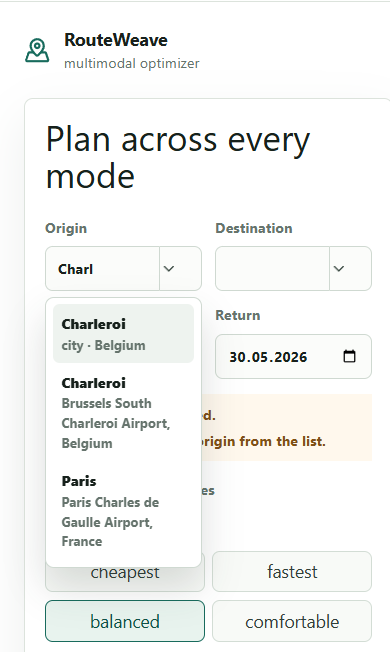
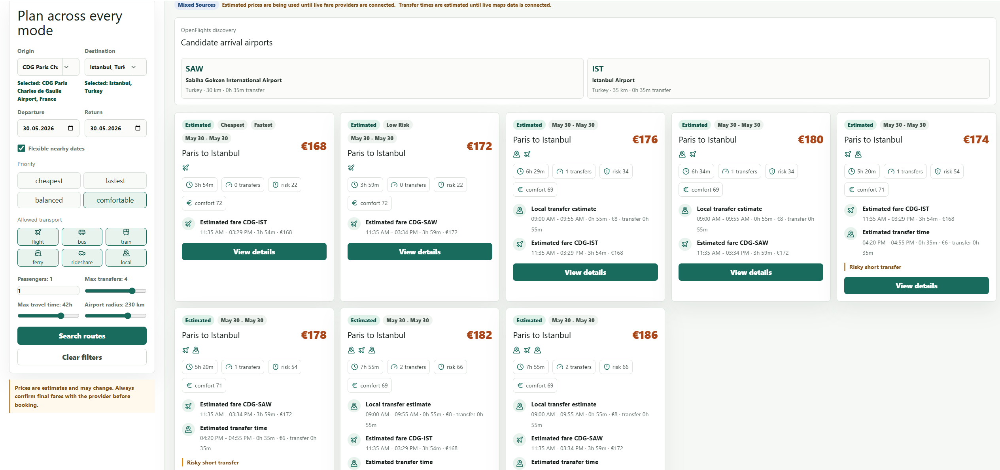
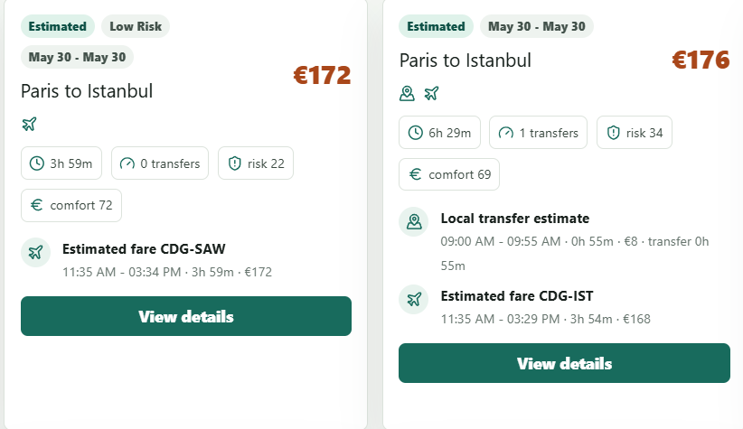
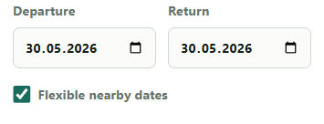

# Multimodal Travel Optimizer

A smart travel planning platform that compares flights, trains, buses, nearby airports, and flexible travel dates to discover the most efficient and cost-effective travel routes.

Unlike traditional flight search engines, this project evaluates multimodal transportation options and alternative travel dates to uncover routes that may be significantly cheaper or more convenient.

---

## Features

### Smart Route Optimization

- Direct flight search
- Nearby airport discovery
- Alternative departure airports
- Alternative arrival airports
- Flight + Train combinations
- Flight + Bus combinations
- Multimodal route recommendations
- Cost and duration comparison

### Flexible Date Search

Instead of evaluating only the exact dates selected by the user, the optimizer can also analyze:

- Departure ±1 day
- Departure ±2 days
- Return ±1 day
- Return ±2 days
- Cross-month travel periods
- Longer stays
- Shorter stays

This allows travelers to discover more affordable and optimized travel options.

### Airport-Aware Search

Cities with multiple airports are handled individually.

Example:

- Istanbul Airport (IST)
- Sabiha Gökçen Airport (SAW)

Users can either select a specific airport or allow the optimizer to evaluate all available airports.

### Intelligent Search Interface

- Real-time autocomplete
- Airport code suggestions
- Country information
- Airport information
- Fast destination filtering

### Route Comparison

Routes are compared using:

- Total cost
- Total travel duration
- Number of transfers
- Transportation type
- Airport accessibility
- Travel flexibility

---

## Example Scenario

### User Input

- Origin: Istanbul
- Destination: Paris
- Dates: June 10 – June 17

### Optimizer Results

#### Option 1

- Istanbul (IST) → Paris (CDG)
- Direct Flight
- €220

#### Option 2

- Istanbul (SAW) → Brussels (BRU)
- Flight
- Brussels → Paris
- Train
- €145

#### Option 3

- Istanbul → Sofia
- Bus
- Sofia → Paris
- Flight
- €120

The optimizer ranks routes according to overall value and efficiency.

---

## Screenshots

### Home Page

Main search interface where users select departure city, destination, and travel dates.



---

### Airport Search & Autocomplete

Autocomplete system displaying matching cities and airport codes while typing.



---

### Route Search Results

List of generated travel options with pricing and duration information.



---

### Route Comparison

Comparison between direct flights and multimodal alternatives.



---

### Route Details

Detailed route breakdown showing every transportation step.


---

### Flexible Date Optimization

Alternative travel dates analyzed by the optimizer.



---

## Sample Dataset

The project currently includes:

- 40+ cities
- 50+ airports
- Flight routes
- Bus routes
- Train routes
- Airport metadata
- Route combinations

This dataset is intended for testing and demonstration purposes.

---

## Technology Stack

### Frontend

- React
- TypeScript
- Vite
- Tailwind CSS

### Backend

- Firebase

### Hosting

- Firebase Hosting

---

## Project Structure

```text
src/
├── components/
├── pages/
├── services/
├── data/
├── hooks/
├── utils/
├── types/
└── assets/
```

---

## Installation

```bash
git clone https://github.com/meehhmett/multimodal-travel-optimizer.git

cd multimodal-travel-optimizer

npm install

npm run dev
```

---

## Future Improvements

- Real-time flight APIs
- Real-time train APIs
- Real-time bus APIs
- Hotel integration
- AI-powered route recommendations
- Carbon footprint calculations
- User accounts
- Saved trips
- Travel alerts
- Mobile application

---

# Türkçe

## Multimodal Travel Optimizer Nedir?

Multimodal Travel Optimizer, kullanıcıların en uygun seyahat rotalarını bulabilmesi için uçak, tren ve otobüs alternatiflerini birlikte değerlendiren akıllı bir seyahat planlama platformudur.

Geleneksel uçuş arama sistemlerinden farklı olarak sistem:

- Yakın havalimanlarını değerlendirir
- Uçak + tren kombinasyonlarını inceler
- Uçak + otobüs kombinasyonlarını inceler
- Esnek tarih araması yapar
- Daha uygun maliyetli alternatif rotalar bulabilir

---

## Özellikler

### Akıllı Rota Optimizasyonu

- Direkt uçuş arama
- Yakın havalimanı desteği
- Çoklu havalimanı karşılaştırması
- Uçak + tren kombinasyonları
- Uçak + otobüs kombinasyonları
- Maliyet ve süre optimizasyonu

### Esnek Tarih Arama

Sistem yalnızca seçilen tarihleri değil;

- ±1 gün
- ±2 gün
- Daha kısa konaklama
- Daha uzun konaklama
- Farklı aylara taşan seyahat tarihleri

  
gibi alternatifleri de değerlendirerek daha avantajlı seçenekler sunar.

### Akıllı Arama Sistemi

Şehir veya havalimanı yazılırken:

- Otomatik tamamlama
- Havalimanı kodları
- Ülke bilgileri
- Hızlı filtreleme

özellikleri sağlanır.

---

## Kullanılan Teknolojiler

### Frontend

- React
- TypeScript
- Vite
- Tailwind CSS

### Backend

- Firebase

### Hosting

- Firebase Hosting

---

## Gelecekte Eklenebilecek Özellikler

- Gerçek zamanlı uçuş verileri
- Gerçek zamanlı tren verileri
- Gerçek zamanlı otobüs verileri
- Otel entegrasyonu
- Yapay zeka destekli rota önerileri
- Karbon ayak izi hesaplama
- Kullanıcı hesapları
- Kaydedilmiş seyahatler
- Seyahat bildirimleri
- Mobil uygulama desteği

---

## License

MIT License
